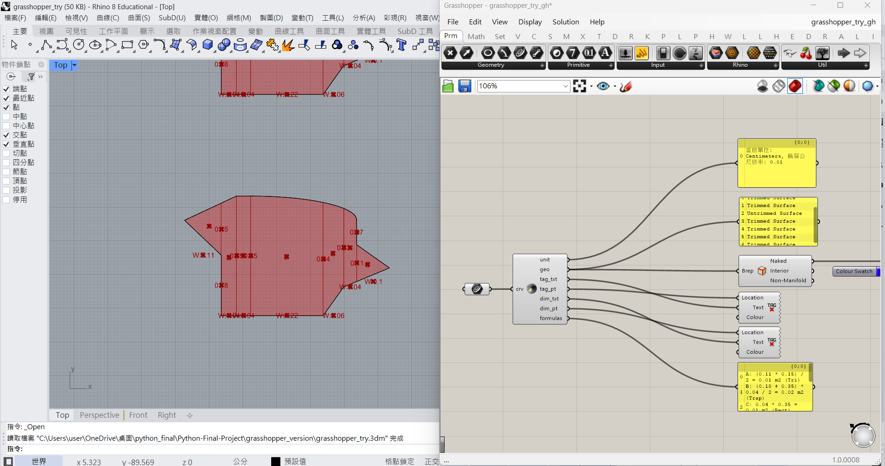
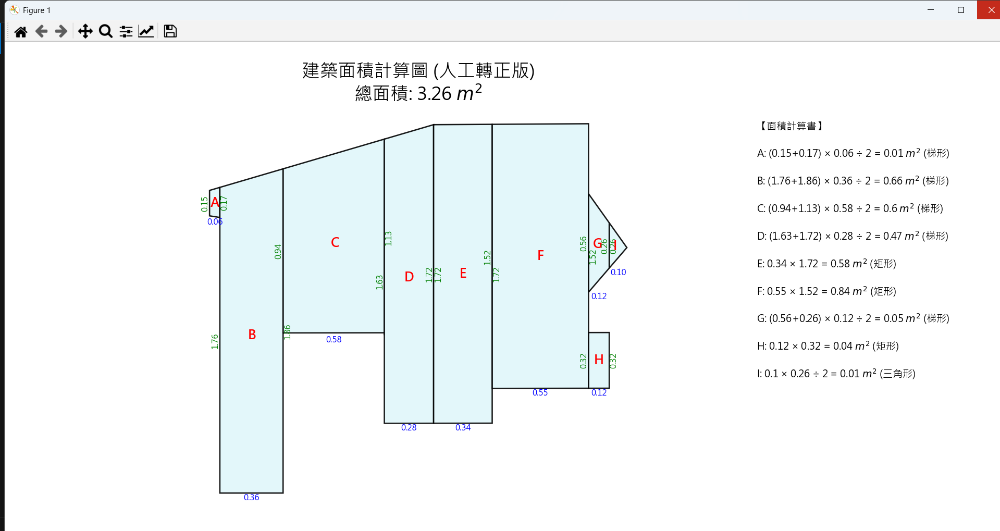

# Python-Final-Project: 建築面積自動化計算框架
專案狀態：Phase 4 - 全面整合 (DXF 解析 + Rhino/Grasshopper 實作)
開發者：txujiz
語言：Python 3.9.10 / IronPython 2.7 / Rhino Python 2

## 1. 專案簡介 (Abstract)
本專案旨在解決建築實務中，面積計算依賴人工描繪或像素計算導致的精度誤差與效率低落問題。本專案提出一套自動化框架，包含兩個主要分支：

### 獨立 DXF 解析版：基於 ezdxf 與 shapely，直接解析 AutoCAD DXF 檔案。

### Rhino/Grasshopper 整合版：基於 RhinoCommon，直接在建築設計軟體 Rhino 8 中實現即時的面積剖分、標註與算式生成。

目前階段已完成開發環境建置，並成功解決了 Rhino 8 新版 Python 引擎的資料傳輸問題，實現了包含矩形、梯形、三角形及圓弧/橢圓的混合幾何精確計算。

## 2. 當前進度 (Current Progress)
截至 2025/12/30，本專案已完成以下關鍵里程碑：

### 核心演算法

[A] 函式庫整合：整合 ezdxf, shapely (Standalone) 與 Rhino.Geometry (Rhino Embedded)。

[B] 幾何最佳化切割：

實作垂直剖分法，將任意多邊形切割為易於計算的幾何單元。
實作智慧合併演算法，修復過度切割的碎塊。

Rhino/Grasshopper 特別實作 (New!)
[C] 混合幾何處理 (Curves & Arcs)：

突破傳統多段線切割限制，採用特徵點抓取 (Feature Point Detection)。
實現「矩形+圓弧」或「橢圓」的混合計算，避免將圓弧切碎，並自動套用等效矩形公式 (W x AvgH)。

[D] 系統穩定性優化：

解決 Rhino 8 Python 3 與 Grasshopper 間的幾何傳輸 Bug (Null Geometry)。
採用 C# 原生容器 (System.Collections.Generic) 取代 Python List，大幅提升資料傳輸穩定性。

[E] 自動化視覺輸出：

自動單位換算：自動偵測 Rhino 模型單位並統一轉換為公尺 (m)。
視覺化標註：在 Viewport 直接生成區塊編號 (A, B, C...) 與切割線尺寸。
算式生成：輸出符合建築法規的文字算式 (如 A: (上底+下底) * 高 / 2 = 面積)。

## 3. 系統需求 (Prerequisites)
### 分支 A: 獨立 DXF 版
Python 3.9+

ezdxf, shapely, matplotlib

安裝指令： pip install ezdxf shapely matplotlib

### 分支 B: Rhino 整合版
Rhino 8 (SR5 以上版本佳)

Grasshopper (內建於 Rhino)

無需額外安裝 pip 套件，使用 Rhino 內建 Python 3 引擎。

## 4. 專案結構 (File Structure)
Plaintext

Python-Final-Project/
├── dxf_implementation/        # [分支 A] 獨立 DXF 解析
│   ├── data/
│   ├── final_app.py           # 整合版主程式
│   └── python_plan_try.dxf    # 測試用建築平面圖
│
├── rhino_implementation/      # [分支 B] Rhino/GH 整合實作 (New)
│   ├── Area_Calculator_v2.gh  # Grasshopper 定義檔
│   ├── test_geometry.3dm      # Rhino 測試模型 (含圓弧與多邊形)
│   └── gh_script_source.py    # (備份) GH 內部的 Python 原始碼
│
└── README.md                  # 專案說明文件

## 5. 使用規範 (Usage Guidelines)
### CAD/DXF 前置處理
單一圖層：將需計算的邊界獨立輸出。

封閉多段線：確保所有邊界閉合 (Closed Polyline)。

格式：AutoCAD 2013 ASCII DXF。

### Rhino/Grasshopper 操作
開啟 Rhino 8 與 Grasshopper。

載入 Area_Calculator_v2.gh。

在 Rhino 中選取要計算的封閉曲線 (Curve)。

在 Grasshopper 的 Curve 電池按右鍵 -> Set One Curve。

程式將自動在畫面上顯示切割線、尺寸與算式面板。

## 6. 後續開發路線 (Roadmap)
本研究預計分為四個階段執行，目前已全數完成核心功能：

[x] Phase 1 (Done): 環境建置與基礎三角分割驗證。

[x] Phase 2 (Done): 實作直角多邊形與梯形剖分 (Decomposition)。

[x] Phase 3 (Done): 處理圓弧與曲線邊界 (於 Rhino 版本中實現)。

採用智慧節點偵測，不將圓弧切碎。

實現橢圓與混合弧形的平均高演算法。

[x] Phase 4 (Done): 自動生成包含算式的文字報告與視覺化標註。

## 成果展示 (Demo)

### Rhino 實作畫面
這是自動化計算面積的實際操作畫面，包含自動編號與切割線尺寸標註：

### dxf 在python測試
使用 Python 腳本進行幾何演算與資料清理：
